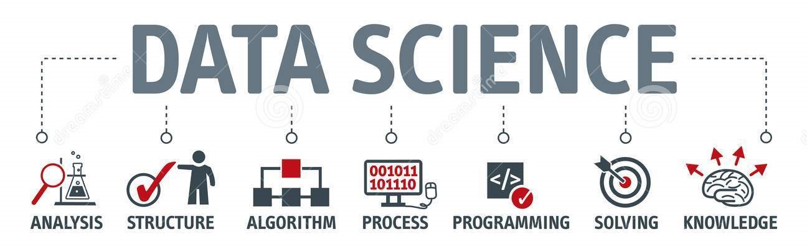

   

  

# Rodrigo Azevedo
Assistente Pleno I no Grupo Trigo

**Contato:**
* [E-mail](razevedo.contato@gmail.com)
* [LinkedIn](https://www.linkedin.com/in/azevedo94/)

**Links:**
* [Blog Medium](https://bit.ly/33QJREb)

## Bootcamp:
* **Aceleração Codenation: Projects realized during the acceleration promoted by Codenation:** https://bit.ly/3iVk8QZ

## Projetos:
* **EDA(Exploratory data analysis): Applying basic Data Analysis commands to the Titanic dataset:** https://bit.ly/32lcbxy
* **EDA(Exploratory data analysis): Data Analysis applied to Stack Overflow research dataset:** https://bit.ly/2MbhjQr
* **EDA(Exploratory data analysis) and Machine Learning(XGBoost): Data Analysis applied to the AirBnB Seattle dataset:** https://bit.ly/3cA3xlr

---

